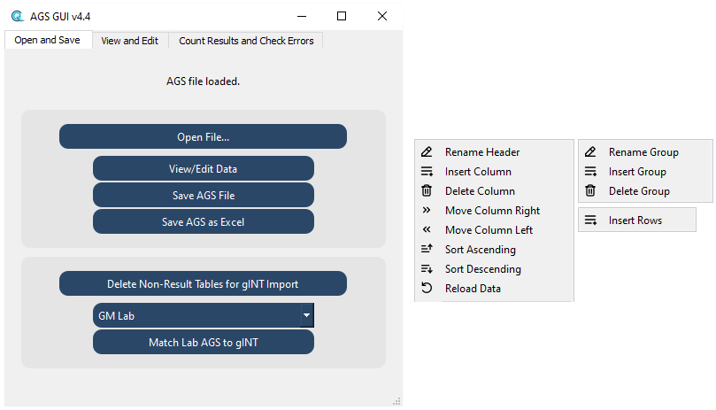

### **Open, edit and check .AGS files used in onshore & offshore geotechnical site investigations**
<br>

#### Steps for gINT Import:
     - Open an AGS file
     - Delete Non-Result Tables
     - Select a laboratory from the dropdown list, then select 'Match Lab AGS to gINT'
     - Select a gINT when prompted by dialogue box (check the gINT is correct)
     - Once 'Matching Complete!' is displayed, select 'Save AGS file'
     - Save the file when prompted by the dialogue box
     - Open gINT, go to File > Import AGS
     - Select the saved AGS file, and use the .gci import correspondence file in this repository

- [Open and Save](#open-and-save)
- [View and Edit](#view-and-edit)
- [Count Results and Check Errors](#count-results-and-check-errors)
<br>



```
Installation:
pip install -r 'requirements.txt'
Compile with auto-py-to-exe using AGS-GUI/common/auto_py_to_exe_config.json
```

#### Open and Save
  - Open File: opens any valid AGS files
    - Use the 'AGS4_package_edit.py' file to replace 'AGS4.py' in <i>Python/lib/site-packages/python_ags4/</i>
        - This allows misplaced carriage returns characters (line-breaks) to be concatenated onto the line above<br>
        <i>Bugfix for - Error: Line x does not have the same number of entries as the HEADING.</i>
        - This commonly occurs in remark fields '_REM' or comments and prevents the file from being opened with the python_ags4 library
  - Save File: allows the current state of the loaded AGS to be saved, into either AGS or Excel
  - Delete Non-Result Tables and gINT data matching
    - This deletes all non-testing tables with the exception of PROJ and TRAN, so that only testing data is used for importing to gINT
      - PROJ and TRAN are the minimum required for gINT to recognise the file as valid AGS
    - Matches records in each table to gINT SPEC data, using the LOCA_ID, SPEC_REF and SPEC_DPTH values
      - This is tailored for a few onshore labs where patterns in data can be used for data cleaning and manipulation prior to import
      - Can be utilised for QA of values or missing key fields
      - Python code can be amended for any SQL database using pyodbc, not specifically gINT. SPEC can be substituted for SAMP, along with any table/header adjustments


#### View and Edit
  - The loaded AGS, extracted as a dictionary of DataFrames, opens groups and data into subclassed QTableViews with a subclassed QAbstractTableModel
  - There are right-click context menus for the QHeaderView, the QTableView holding the groups and the QTableView holding the data
    - Editing functions are handled with Pandas (QAbstractTableModel), context menus and the QTableView:
      - Edit fields (cells) in TableView - all edited data will be in the saved exports of AGS or excel using the button functions
      - Copy & paste data, including data to and from excel
      - Delete columns, rows, cells or groups
      - Insert, rename and move columns
        - Columns/headers are edited with the header right-click context menu of the headers, QHeaderView
      - Insert, rename and delete groups
        - Groups are edited with right-click context menu on the groups, left QTableView
        - Inserted groups have one column: 'HEADING', with 'UNIT', 'TYPE', 'DATA' as rows
      - Insert rows
        - Rows are inserted with the right-click context menu on the data, right QTableView
        - Inserted rows are always prefixed with 'DATA' in the first column. Without this, the python_ags4 library will not read the row as valid data
      - Sort data ascending or descending with context menu or on double-click event of a header
        - Sort state toggles on each double-click, with default as index sorting
      - Added groups and headers must also be manually added to the DICT group to avoid AGS4 errors


#### Count Results and Check Errors
  - Count Lab Results: checks most onshore testing groups for fields relating to test type and laboratory
    - For groups with more than one test type (e.g. GCHM, TREG, TRIG), the sample condition is used to distinguish test type
    - Totals can be exported to excel
    - Totals are split between 'Onshore' and 'Offshore' to aid project reporting
  - Check AGS for Errors: uses the AGS standard dictionary to check for errors
    - The AGS version in the TRAN group will be used, AGS4+ versions supported (e.g. '4.1.1', '4.1', '4.0.4', '4.0.3', '4.0')
      - This will check the dictionary for fields named as KEY and REQUIRED as part of the error checking process to establish unique records
      - Errors may arise in DICT with incorrect DICT_STAT on fields, (e.g. if a SPEC_DPTH field is not used as a KEY or REQUIRED field in DICT.DICT_STAT)
      - Error logs can be exported to a .txt file
  - CPT Only Data Export: uses most groups expected to contain CPT data, including seismic
      - Deletes all non-essential tables, keeping only CPT data
  - Lab Only Data Export: uses most onshore testing groups
      - Deletes all non-essential tables, keeping only Lab data as well Geology and Depth Remarks

<br><br>


##### Developed for [Geoquip-Marine](https://www.geoquip-marine.com/) using [AGS 4 Data Format](https://www.ags.org.uk/data-format/), [python-ags4](https://pypi.org/project/python-ags4/), [PyQt](https://doc.qt.io/qtforpython-5/) and [Pandas](https://pandas.pydata.org/).
<br>

   <a href="https://www.geoquip-marine.com/"></a>
   
<br>

##### Anton [(lachesis17)](https://github.com/lachesis17) 🪐
